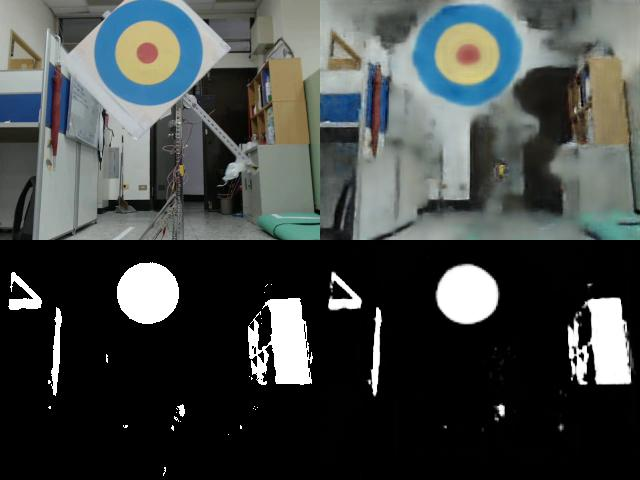

# Task-aware Image Compression with Autoencoder Networks

This repo contains the code for the short paper titled "Task-aware Image Compression with Autoencoder Networks". The basic idea of the paper was evaluating whether outputting a (binary) mask reconstruction along with the standard RGB reconstruction in autoencoder models would result in increased performance in a color detection task. 

### [PDF](https://guichristmann.github.io/assets/pdf/fira_summit_img_compression.pdf)

### [Slides](https://docs.google.com/presentation/d/e/2PACX-1vQWZVam7k7mdi_891WzZzu_wliyASlqTDdrVKwVJmhvNyIZSFMvmW4pLrZcl44c6d-R1Hie84km4EvQ/embed?start=true&loop=false&delayms=5000)

### Model architectures

Model with single output: Raw (RGB) reconstruction

Model with two outputs: Raw (RGB) and Mask reconstruction

### Results

Table of results for both architectures at different image compression rates (bytes per frame):

Example of reconstructions. On the left side is the original RGB and Mask. On the right side is the reconstructed RGB and Mask:

##### TODO
Right now, the repo is bascially just a storage for the python scripts. Later it should be cleaned up and presented in a nicer way, with an example dataset and better description of the method.
